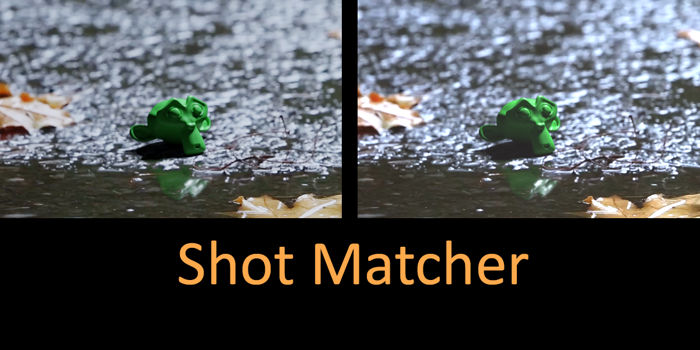

This Blender add-on improves the compositing workflow
by matching two layers or shots together via color grading.
After analyzing the color ranges of two layers,
the add-on applies it to the compositor.
The panels for this add-on can be found in the Image Editor on the right shelf,
or in the Movie Clip Editor on the left shelf.

## Auto Calculator
This takes the max and min RGB values for the selected image or video.
An alpha threshold option is available to filter out transparent pixels.

It's usually unnecessary to analyze every frame of a movie clip.
Use the frame start, end, and step fields
to balance an accurate analysis with a quick calculation time.

## Color Picker
This gives you more precision when analyzing images.
While the color picker is on, left click and drag the mouse to color pick,
right click to apply and finish, or press "Escape" to cancel.
It will then take the max and min values picked,
and update the panel's color values.

The picker compares its results to the black and white values you currently have,
so if you don't find a darker black or whiter white,
the current values will stay as it is.
The picker can also take your alpha threshold into account.

This feature is only available for the image editor.
If you'd need to color pick a movie clip frame, you can
open the video files as images, and then analyze a frame from the image editor.

### Reset Color Picker
This resets your min color to absolute white, and your max color to absolute black,
in case you accidentally picked an area that throws off your black or white values.

### Set as Selected
This sets the current image or video you're viewing as the target or source layer.
Shot Matcher can analyze any image or video loaded in your .blend file,
regardless of whether it's currently visible in the user interface.

## Applying to the Compositor

For both operators, the redo panel has an option to also apply midtones
to the color balance node.
Using the midtone analysis may skew the colors, so this is off by default.

### Color Balance Node
Adds a color balance node to your compositor,
mapping the black and white values from the source to the target.
This keeps color ranges consistent between the layers without overlaying them.

### Alpha Over Node
Adds a color matching node group to your compositor,
mapping the black and white values from the source to the target.
This overlays the layers onto one image.

## How to Use

1. Select your source and target layers.
1. Your source layer is the image or movie clip that you want to change.
1. Your target layer is the image or video that will receive the source layer's colors.
1. You can select the image or movie clip from the textbox or the "Use Current Image/Clip" button to get the file you are currently viewing.
1. For each layer, analyze the black and white points. Use either the auto calculator or the color picker. 
   - For the calculator, simply press the button and let it pick the max and min RGB values in the image.
   - To use the color picker, first click "Reset Colors" in the Shot Matcher panel.
     Click "Color Pick" and find the pixels meant to represent the colors white and black.
     Hover over the area, hold down the left mouse button, and move the cursor to pick up the colors.
     You should see the white and black colors in the panel update as you do so.
     Simply click the left or right mouse button to accept your changes, or press "Escape" to cancel.
     Feel free to do it again and again to update the current white and black colors you have,
     or you can restart with "Reset Colors."
   - For movie clips, adjust the start frame, end frame, and frame step for the auto calculator.
     If you wish to color pick a movie clip, load the movie clip into Blender as an image.
     On the side panel, you can change the current frame to your liking.
1. With your selected colors for each layer, select a node groups to generate.
The "alpha over" is for merging of layers, while the color balance one is helpful for just matching colors.
1. If you need to update the colors, just adjust them and click the node button again
   to update the existing node or group.
   If you change the node label or node group name, Shot Matcher will create a new one instead of updating.

## Auto-saving and Purging Settings
The layer settings are saved for each image and movie clip you use with the .blend file.
The layers are saved whenever you change layers in the Shot Matcher panel
(done by selecting a different image or movie in the dropdown),
as well as when you save your Blender project.
Upon loading your Blender project, the add-on will check if each layer setting can find its image or clip.
If no matching image or movie clip can be found, the setting will be removed to save space.